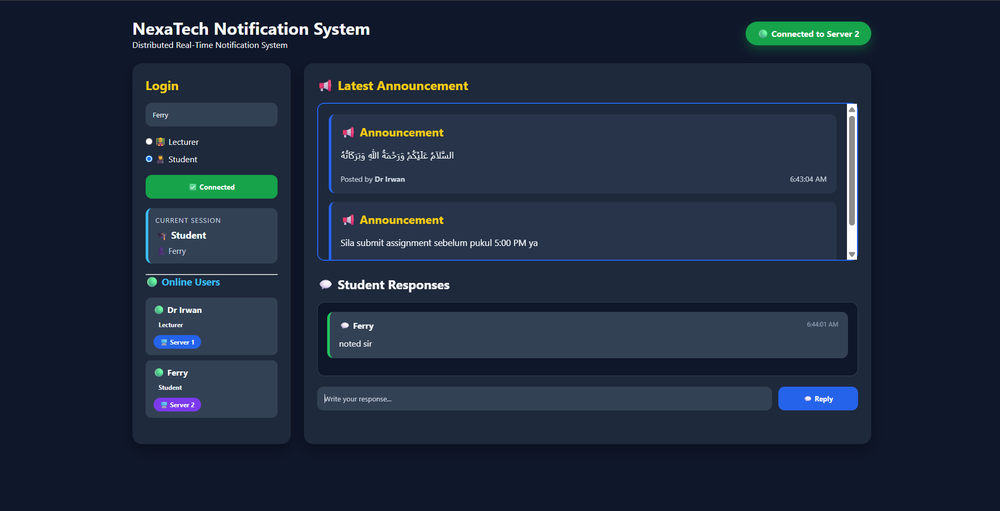
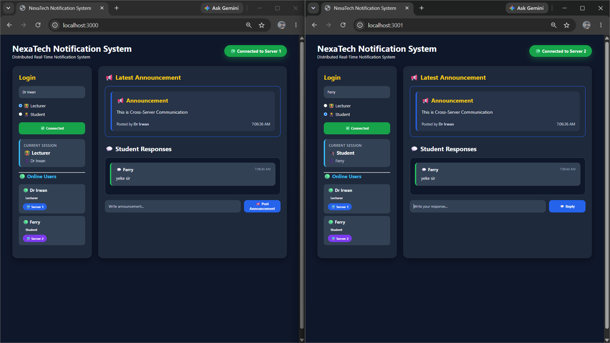
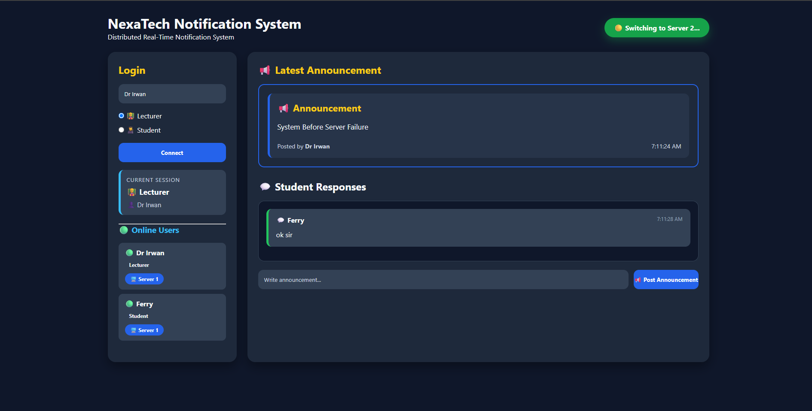

# NexaTech Notification System

A distributed real-time notification system built with Node.js, Socket.IO and Redis Pub/Sub for lecturer-student communication.

## Overview

NexaTech Notification System is a distributed real-time communication system developed as an academic project.

The system allows Lecturers to broadcast announcements and Students to receive and respond to messages in real time. WebSocket communication is used for instant message delivery, while Redis Pub/Sub synchronizes communication between multiple application servers.

The system also implements client-side failover and automatic reconnection to maintain communication when one application server becomes unavailable.

## Features

- Lecturer and Student role-based interaction
- Real-time announcement broadcasting
- Real-time student responses
- WebSocket communication using Socket.IO
- Redis Pub/Sub for cross-server synchronization
- Multi-server architecture
- Client-side server failover
- Automatic reconnection after server failure
- Multi-user communication
- Real-time connected-user updates

## Application Screenshots

### Main Dashboard



The main dashboard provides role-based login, real-time announcements, student responses and connected-user information.

### Multi-Server Communication



The application running across Server 1 and Server 2, demonstrating real-time communication and cross-server synchronization.

### Server Failover



The system detecting a server failure and switching the client connection to another available server.

## System Architecture

The system uses two application servers connected through Redis Pub/Sub.

```text
                  +----------------+
                  |     Redis      |
                  |    Pub/Sub     |
                  +-------+--------+
                          |
             +------------+------------+
             |                         |
     +-------+-------+         +-------+-------+
     |    Server 1   |         |    Server 2   |
     |    Port 3000  |         |    Port 3001  |
     |    Node.js    |         |    Node.js    |
     |    Socket.IO  |         |    Socket.IO  |
     +-------+-------+         +-------+-------+
             |                         |
             +------------+------------+
                          |
                  +-------+-------+
                  |    Clients    |
                  | Lecturer /    |
                  |   Student     |
                  +---------------+
```

Redis Pub/Sub allows messages and connected-user information to be synchronized between Server 1 and Server 2.

## Failover Mechanism

NexaTech includes client-side failover to improve service availability.

When the connected application server becomes unavailable:

1. The client detects the server disconnection.
2. The client attempts to connect to another available server.
3. The client reconnects automatically.
4. Communication can continue through the available server.

If both servers are unavailable, the system displays a "No Server Available" state.

## Technologies

- Node.js
- Express.js
- Socket.IO
- Redis
- Redis Pub/Sub
- HTML
- CSS
- JavaScript

## Project Structure

```text
nexatech-notification/
├── assets/
│   └── screenshots/
│       ├── dashboard.png
│       ├── failover.png
│       └── multi-server.png
├── public/
│   ├── index.html
│   ├── script.js
│   └── style.css
├── redisClient.js
├── server1.js
├── server2.js
├── package.json
├── package-lock.json
└── README.md
```

## How to Run

### 1. Install Dependencies

Make sure Node.js and Redis are installed.

Install the project dependencies:

```bash
npm install
```

### 2. Start Redis

Start the Redis server:

```bash
redis-server
```

Keep Redis running.

### 3. Start Server 1

Open another terminal in the project directory:

```bash
node server1.js
```

Server 1 runs on:

```text
http://localhost:3000
```

### 4. Start Server 2

Open another terminal:

```bash
node server2.js
```

Server 2 runs on:

```text
http://localhost:3001
```

### 5. Open the Application

Open the application in a web browser and connect as a Lecturer or Student.

The system can then be tested using multiple browser sessions to simulate multiple users and different servers.

## Fault Tolerance Testing

The system can be tested by:

1. Starting Redis.
2. Starting Server 1 and Server 2.
3. Connecting clients to the application.
4. Sending announcements and responses.
5. Stopping one application server.
6. Observing the client failover and automatic reconnection.
7. Verifying that communication continues through the available server.

## Project Purpose

The project demonstrates the implementation of real-time communication and distributed application concepts, including:

- WebSocket-based communication
- Redis Pub/Sub
- Multi-server communication
- Client-side failover
- Automatic reconnection
- Real-time user synchronization
- Role-based interaction

## Developer

**Ferry Irwan Shah bin Azman**

Diploma in Computer Science  
Kolej Profesional MARA Beranang (KPM)

GitHub: [ferryyirwan](https://github.com/ferryyirwan)

LinkedIn: [Ferry Irwan](https://www.linkedin.com/in/ferry-irwan-889b25428)
